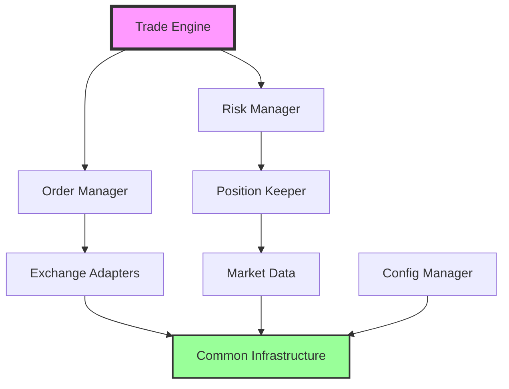

# Component Catalog

## Overview

Comprehensive catalog of all components in the Shriven Zenith trading system, organized by functional area.

## Component Status Legend

| Icon | Status | Description |
|------|--------|-------------|
| ✅ | Complete | Fully implemented, tested, and documented |
| 🚧 | In Progress | Partially implemented |
| 📋 | Planned | Designed but not implemented |
| 🔬 | Experimental | Research/prototype phase |

## Component Hierarchy

```
Shriven Zenith Trading System
├── Common Infrastructure ✅
├── Configuration Management ✅
├── Exchange Connectivity
│   ├── Zerodha Adapter ✅
│   └── Binance Adapter ✅
├── Market Data
│   ├── Instrument Manager ✅
│   └── Order Book 🚧
├── Trading Core
│   ├── Order Manager 📋
│   ├── Position Keeper 📋
│   └── Trade Engine 📋
└── Risk Management 📋
```

## 1. Common Infrastructure Components ✅

### 1.1 Lock-Free Queue
**Status**: ✅ Complete  
**File**: `common/lf_queue.h`  
**Purpose**: Thread-safe message passing  
**Performance**: 42ns enqueue/dequeue  

Key Features:
- SPSC and MPSC variants
- Cache-aligned for zero false sharing
- No dynamic allocation
- ABA problem prevention

[📖 Full Documentation](common/lf_queue_component.md)

### 1.2 Memory Pool
**Status**: ✅ Complete  
**File**: `common/mem_pool.h`  
**Purpose**: Fixed-time memory allocation  
**Performance**: 26ns allocate/deallocate  

Key Features:
- Pre-allocated blocks
- O(1) allocation
- Thread-safe with atomics
- Zero fragmentation

[📖 Full Documentation](common/mem_pool_component.md)

### 1.3 Logging System
**Status**: ✅ Complete  
**Files**: `common/logging.h`, `common/logging.cpp`  
**Purpose**: Low-overhead diagnostics  
**Performance**: 35ns per log call  

Key Features:
- Lock-free ring buffer
- Async file writing
- Compile-time filtering
- Nanosecond timestamps

[📖 Full Documentation](common/logging_component.md)

### 1.4 Thread Utilities
**Status**: ✅ Complete  
**File**: `common/thread_utils.h`  
**Purpose**: Thread management and optimization  

Key Features:
- CPU affinity setting
- Real-time priority
- NUMA awareness
- Isolation from OS threads

[📖 Full Documentation](common/thread_utils_component.md)

### 1.5 Time Utilities
**Status**: ✅ Complete  
**File**: `common/time_utils.h`  
**Purpose**: High-precision timing  
**Performance**: 15ns for rdtsc  

Key Features:
- TSC-based timestamps
- Nanosecond precision
- Calendar conversions
- NTP synchronization helpers

[📖 Full Documentation](common/time_utils_component.md)

## 2. Configuration Management ✅

### 2.1 ConfigManager
**Status**: ✅ Complete  
**Files**: `config/config_manager.h`, `config/config_manager.cpp`  
**Purpose**: Centralized configuration  

Key Features:
- Master config file parsing
- Environment variable loading
- Directory management
- Runtime reloading

Configuration Hierarchy:
```
master_config.txt
├── Environment file path
├── Directory paths
├── Runtime settings
└── Exchange endpoints
```

[📖 Full Documentation](config/config_manager_component.md)

## 3. Exchange Connectivity

### 3.1 Zerodha Adapter ✅
**Status**: ✅ Complete  
**Files**: `trading/auth/zerodha/*`  
**Purpose**: NSE/BSE connectivity via Kite Connect  

Components:
- **Authentication**: TOTP-based login
- **Session Management**: Token refresh
- **Instrument Fetcher**: 68K+ symbols
- **Order Gateway**: REST API (planned)

Performance:
- Login: ~2 seconds (with TOTP)
- Instrument fetch: ~5 seconds for 68K symbols
- Order placement: <100ms (target)

[📖 Full Documentation](exchanges/zerodha_component.md)

### 3.2 Binance Adapter ✅
**Status**: ✅ Complete  
**Files**: `trading/auth/binance/*`  
**Purpose**: Crypto trading via Binance API  

Components:
- **Authentication**: HMAC signatures
- **Rate Limiting**: 100ms minimum interval
- **Instrument Fetcher**: Top 25 or all symbols
- **Order Gateway**: REST API (planned)

Performance:
- Authentication: <100ms
- Top symbols fetch: <2 seconds
- Order placement: <50ms (target)

[📖 Full Documentation](exchanges/binance_component.md)

## 4. Market Data Components

### 4.1 Instrument Manager ✅
**Status**: ✅ Complete  
**Files**: `trading/market_data/*/instrument_fetcher.*`  
**Purpose**: Symbol and instrument management  

Features:
- Daily caching with CSV storage
- Symbol search and filtering
- Expiry tracking (futures/options)
- Contract specifications

Data Model:
```cpp
struct Instrument {
    char symbol[32];
    char exchange[16];
    InstrumentType type;
    double tick_size;
    double lot_size;
    uint32_t expiry;
    // ... more fields
};
```

[📖 Full Documentation](market_data/instrument_manager_component.md)

### 4.2 Order Book 🚧
**Status**: 🚧 In Progress  
**Files**: `trading/market_data/order_book.*` (planned)  
**Purpose**: Real-time order book maintenance  

Planned Features:
- Level 2 market data
- Depth tracking
- VWAP calculations
- Imbalance detection

## 5. Trading Core Components 📋

### 5.1 Order Manager
**Status**: 📋 Planned  
**Purpose**: Order lifecycle management  

Planned Features:
- Order creation/modification/cancellation
- State machine for order status
- Exchange acknowledgment handling
- Fill tracking

### 5.2 Position Keeper
**Status**: 📋 Planned  
**Purpose**: Position and P&L tracking  

Planned Features:
- Real-time position updates
- P&L calculations
- Greeks (for options)
- Portfolio analytics

### 5.3 Trade Engine
**Status**: 📋 Planned  
**Purpose**: Core trading logic orchestration  

Planned Features:
- Strategy framework
- Signal generation
- Execution algorithms
- Smart order routing

## 6. Risk Management 📋

### 6.1 Risk Manager
**Status**: 📋 Planned  
**Purpose**: Real-time risk controls  

Planned Features:
- Pre-trade risk checks
- Position limits
- Loss limits
- Fat finger prevention
- Regulatory compliance

## Component Dependencies



## Testing Coverage

| Component | Unit Tests | Integration | Benchmark | Fuzz |
|-----------|------------|-------------|-----------|------|
| Common Infrastructure | ✅ 100% | ✅ | ✅ | ✅ |
| Config Manager | ✅ 100% | ✅ | ⏳ | ⏳ |
| Zerodha Adapter | ✅ 90% | ✅ | ⏳ | ⏳ |
| Binance Adapter | ✅ 90% | ✅ | ⏳ | ⏳ |
| Instrument Manager | ✅ 85% | ✅ | ⏳ | ⏳ |

## Performance Benchmarks

### Hot Path Components
| Component | Operation | Target | Actual | Status |
|-----------|-----------|--------|--------|--------|
| LF Queue | Enqueue | <100ns | 42ns | ✅ |
| Memory Pool | Allocate | <50ns | 26ns | ✅ |
| Logging | Log Call | <100ns | 35ns | ✅ |
| Order Book | Update | <200ns | TBD | 🚧 |
| Risk Check | Validate | <100ns | TBD | 📋 |

## Development Roadmap

### Phase 1: Foundation ✅
- Common infrastructure
- Configuration management
- Exchange connectivity
- Basic market data

### Phase 2: Trading Core 🚧
- Order management
- Position tracking
- Basic strategies
- Risk controls

### Phase 3: Advanced Features 📋
- Complex strategies
- Portfolio optimization
- Machine learning signals
- Advanced risk analytics

### Phase 4: Production Hardening 📋
- Colocated deployment
- Hardware acceleration
- Regulatory reporting
- Disaster recovery

---

*For detailed component documentation, click on the 📖 Full Documentation links above.*